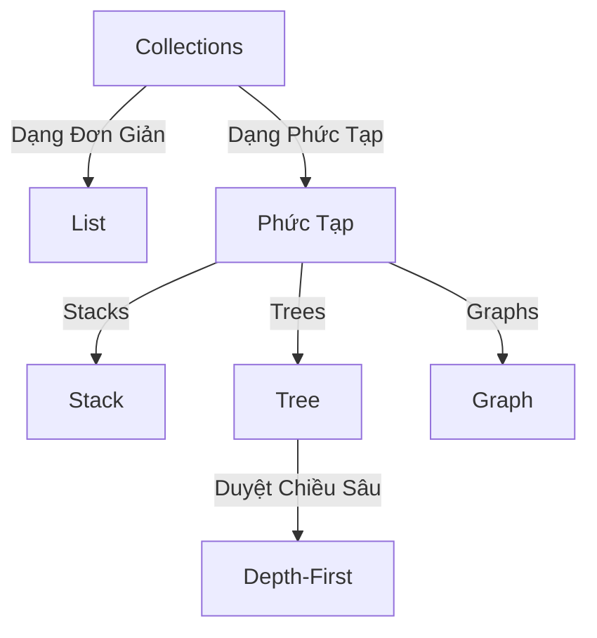
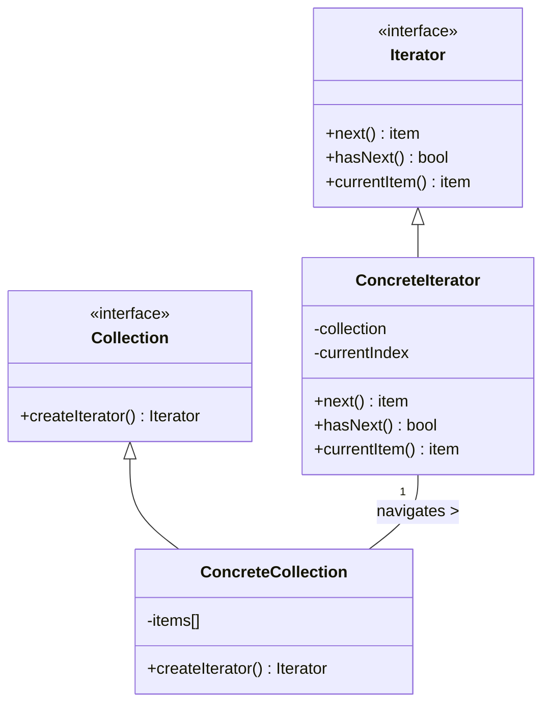
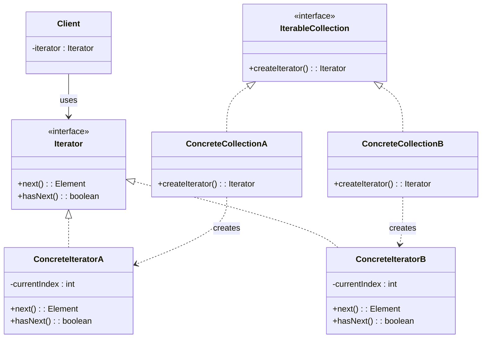

	Truy cập tuần tự các phần tử một tập hợp dữ liệu
---

## Khái Niệm

**Iterator**, trong lĩnh vực phát triển phần mềm, là một mẫu thiết kế hành vi. Nó cho phép bạn duyệt qua các phần tử của một bộ sưu tập (collection) mà không cần quan tâm tới cấu trúc cụ thể của nó, như danh sách (list), ngăn xếp (stack), cây (tree), v.v. Iterator tạo ra một giao diện thống nhất cho việc truy cập và duyệt qua các phần tử, giúp tách rời cách các bộ sưu tập được cấu trúc từ logic duyệt qua chúng.

### Tổng quan

- **Định Nghĩa của Pattern:** Iterator Pattern cung cấp một cách để truy cập tuần tự các phần tử của một bộ sưu tập mà không cần phải hiểu rõ về cấu trúc nội bộ của nó. Điều này được thực hiện thông qua việc sử dụng một đối tượng gọi là 'Iterator' có chức năng duyệt qua và truy cập các phần tử.

- **Mục Đích:** Mục đích chính của Iterator Pattern là giảm sự phụ thuộc trực tiếp giữa các algorithim duyệt và cấu trúc dữ liệu của các bộ sưu tập. Điều này giúp tăng tính mô-đun và khả năng tái sử dụng code, đồng thời cung cấp một cách tiếp cận thống nhất cho việc duyệt dữ liệu.

- **Ý Tưởng Cốt Lõi:** Trong Iterator Pattern, 'Iterator' là trung tâm, nó cung cấp một interface cho việc duyệt qua một bộ sưu tập. Điều này bao gồm khả năng truy cập tuần tự từ phần tử này sang phần tử khác mà không cần can thiệp vào cấu trúc nội bộ hoặc loại bỏ sự phức tạp trong việc duyệt qua các cấu trúc dữ liệu khác nhau.

## Đặt vấn đề

`Collections` là một kiểu dữ liệu phổ biến nhất trong lập trình. Tuy nhiên, `Collection` chỉ là một cấu trúc dữ liệu nhóm các đối tượng lại với nhau.

Hầu hết `collections` lưu trữ các phần tử của chúng một cách đơn giản. Tuy nhiên, có một số `collection` có cách lưu trữ phức tạp như stacks, trees, graphs và các cấu trúc dữ liệu khác.

Dù thế nào, `collections` cần cung cấp các phương thức để truy vấn đến các phần tử mà chúng lưu trữ. Phải có cách nào đó để duyệt qua các phần tử mà không cần phải truy cập lại các phần tử đã truy cập.

Có vẻ đơn giản nếu `collection` là dạng list. Việc duyệt qua các phần tử dễ dàng, chỉ cần sử dụng một vòng lặp for. Nhưng nếu là `collection` dạng phức tạp hơn thì sao? Chẳng hạn như dạng cây, ban đầu bạn phải duyệt theo chiều sâu (depth-first), nhưng sau đó có thể cần duyệt theo chiều rộng (breadth-first). Và một tháng sau, bạn có thể cần truy vấn đến phần tử ngẫu nhiên. Điều này không hề đơn giản chút nào.
## Giải pháp

Giải pháp cho thách thức này chính là áp dụng mẫu thiết kế `Iterator`. Mẫu thiết kế này giúp tách biệt hoàn toàn hành vi duyệt qua các phần tử của `collection` ra khỏi cấu trúc của `collection` đó. Điều này được thực hiện thông qua việc tạo ra một đối tượng riêng biệt, gọi là `iterator`.

Một `iterator` không chỉ thực thi thuật toán duyệt qua các phần tử, mà còn đóng gói chi tiết về quá trình duyệt. Điều này bao gồm việc theo dõi vị trí hiện tại trong `collection` và xác định xem còn bao nhiêu phần tử nữa trước khi hoàn thành quá trình duyệt.

Ngoài ra, việc sử dụng `iterator` cung cấp một giao diện thống nhất cho việc duyệt qua các loại `collections` khác nhau, dù đó là list đơn giản hay cấu trúc phức tạp hơn như trees hay graphs. Điều này đồng nghĩa với việc code của chúng ta trở nên linh hoạt hơn, dễ dàng thích ứng với nhu cầu thay đổi của việc duyệt và truy cập các phần tử trong `collections`.

Một lợi ích khác của việc sử dụng mẫu thiết kế `Iterator` là nó giúp giảm thiểu sự phụ thuộc giữa các `collections` và thuật toán sử dụng để duyệt chúng. Điều này không chỉ giúp code trở nên sạch sẽ hơn mà còn dễ dàng bảo trì và mở rộng trong tương lai.

## Cấu Trúc

---

- **Iterator** : là một interface hoặc abstract class khai báo các hoạt động cần thiết để duyệt qua các phần tử.
- **Concrete Iterators** : cài đặt các phương thức của Iterator, giữ index khi duyệt qua các phần tử.
- **Iterable Collection** : là một interface tạo ra một hoặc nhiều phương thức cho để lấy `interators` tương thích với `Collection`.
- **Concrete Collections** : cài đặt các phương thức Iterable Collection, nó cái đặt interface tạo Iterator trả về một Concrete Iterators thích hợp.
- **Client** : Đối tượng sử dụng Iterator Pattern.

## Khi nào nên sử dụng Iterator

Iterator là một công cụ hữu ích trong lập trình, đặc biệt là khi bạn đối mặt với các tình huống sau:

1. **Khi Cấu Trúc Dữ Liệu Phức Tạp:** Sử dụng Iterator khi bạn có một bộ sưu tập (collection) với cấu trúc phức tạp. Iterator giúp bạn duyệt qua các phần tử mà không cần phải lo lắng về cách chúng được tổ chức bên trong.
    
2. **Bảo Mật Thông Tin Cấu Trúc:** Khi bạn không muốn tiết lộ chi tiết cấu trúc nội bộ của bộ sưu tập đến với người dùng (clients), Iterator là lựa chọn phù hợp. Nó cung cấp một giao diện đơn giản để tương tác với dữ liệu mà không hé lộ chi tiết phức tạp.
    
3. **Giảm Thiểu Mã Lặp:** Iterator giúp giảm thiểu lượng mã cần thiết để duyệt qua các phần tử. Thay vì viết các vòng lặp phức tạp, bạn có thể sử dụng các hàm của Iterator để làm việc này một cách gọn gàng và hiệu quả hơn.