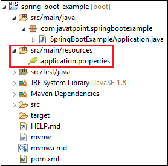

---
Spring Boot Framework comes with a built-in mechanism for application configuration using a file called **application.properties**. It is located inside the **src/main/resources** folder, as shown in the following figure.

The application.properties file allows us to run an application in a **different environment.** In short, we can use the application.properties file to:

- Configure the Spring Boot framework
- define our application custom configuration properties

More: [Spring Boot Properties - javatpoint](https://www.javatpoint.com/spring-boot-properties)

