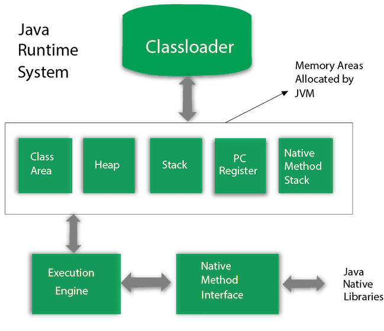

---
JVM (Máy ảo Java) là một máy trừu tượng. Nó là một đặc tả cung cấp môi trường thời gian chạy trong đó mã byte java có thể được thực thi.

JVM có sẵn cho nhiều nền tảng phần cứng và phần mềm (tức là JVM phụ thuộc vào nền tảng).

---
## What is JVM

1. A specification nơi hoạt động của Máy ảo Java được chỉ định. Nhưng nhà cung cấp triển khai độc lập trong việc lựa chọn thuật toán. Việc triển khai nó đã được cung cấp bởi Oracle và các công ty khác.
2. An implementation Việc triển khai nó được gọi là JRE (Java Runtime Environment).
3. Runtime Instance Bất cứ khi nào bạn viết lệnh java trên dấu nhắc lệnh để chạy lớp java, một phiên bản của JVM sẽ được tạo.

## What it does

JVM thực hiện thao tác sau:

- Loads code
- Verifies code
- Executes code
- Provides runtime environment

JVM cung cấp các định nghĩa cho:

- Memory area
- Class file format
- Register set
- Garbage-collected heap
- Fatal error reporting etc.

## JVM Architecture

1) Classloader
	Classloader là một subsystem của JVM nó được sử dụng để load class file. Khi chúng ta chạy java program nó sẽ chạy đầu tiên. Bên trong bao gồm 3 thành phần.
		1. Bootstrap Classloader: Nó là thành phần đầu tiên với nhiệm vụ chính là load các thư viện.
		2. Extension ClassLoader: Đây là thành phần con của Bootstrap nhiệm vụ load directory từ thư mục $JAVA_HOME/jre/lib/ext.
		3. System/Application ClassLoader: Thành phần cuối trong ClassLoader. Nó load classfile từ classpath bởi mặc định. Bạn có thể thay đổi classpath.

2) Class(Method) Area
		Lưu trữ các cấu trúc trên mỗi lớp như nhóm hằng số thời gian chạy, dữ liệu trường và phương thức, mã cho các phương thức.
3) Heap
		Đây là vùng dữ liệu thời gian chạy trong đó các đối tượng được phân bổ.
4) Stack
		Java Stack lưu trữ các khung. Nó chứa các biến cục bộ và một phần kết quả, đồng thời đóng vai trò trong việc gọi và trả về phương thức.

	Mỗi luồng có một ngăn xếp JVM riêng, được tạo cùng lúc với luồng.

	Một khung mới được tạo mỗi khi một phương thức được gọi. Một khung bị hủy khi việc gọi phương thức của nó hoàn tất.

5) Program Counter Register
		Thanh ghi PC (bộ đếm chương trình) chứa địa chỉ của lệnh máy ảo Java hiện đang được thực thi.
6) Native Method Stack
		Nó chứa tất cả các phương thức gốc được sử dụng trong ứng dụng.
7) Execution Engine
		Nó chứa:
			1. A virtual processor
			2. Interpreter: Đọc luồng mã byte rồi thực hiện hướng dẫn.
			3. Just-In-Time compiler: Nó được sử dụng để cải thiện hiệu suất. JIT biên dịch các phần của mã byte có chức năng tương tự cùng một lúc và do đó giảm lượng thời gian cần thiết để biên dịch. Ở đây, thuật ngữ "trình biên dịch" dùng để chỉ một trình dịch từ tập lệnh của máy ảo Java (JVM) sang tập lệnh của một CPU cụ thể.
8) Java Native Interface
		là một khung cung cấp giao diện để giao tiếp với một ứng dụng khác được viết bằng ngôn ngữ khác như C, C++, Assembly, v.v. Java sử dụng khung JNI để gửi đầu ra tới Bảng điều khiển hoặc tương tác với các thư viện hệ điều hành.

