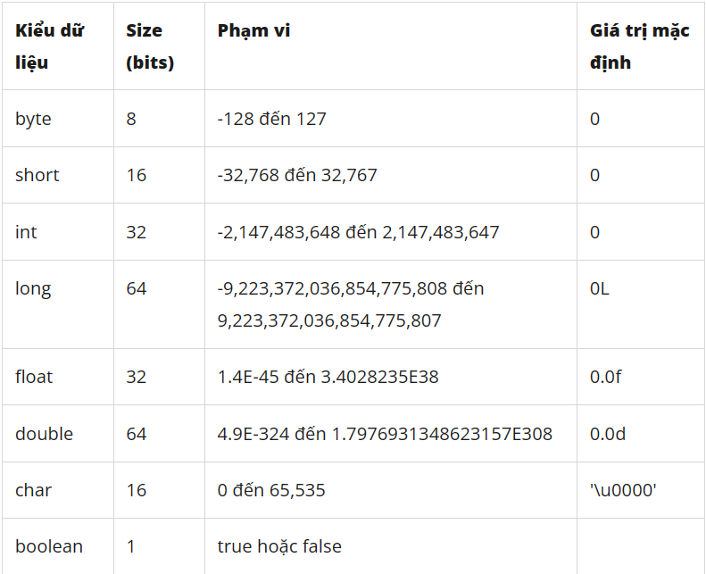
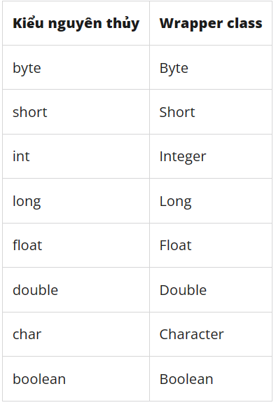

# Quy tắc đặt tên, kiểu dữ liệu và ép kiểu, toán tử, cấu trúc điều khiển và rẽ nhánh

## Quy tắc đặt tên

- Tên các biến và phương thức nên được bắt đầu bằng một chữ cái viết thường, và sau đó là các chữ cái tiếp theo viết hoa, không sử dụng khoảng trắng.

- Tên lớp nên được bắt đầu bằng một chữ cái viết hoa và nên sử dụng kiểu đặt tên CamelCase (tức là, các từ tiếp theo sẽ được viết hoa).

- Tên hằng số nên được viết hoa toàn bộ và các từ cách nhau bằng dấu gạch dưới (_).

- Tên gói (package) nên được viết bằng chữ thường, các từ cách nhau bằng dấu chấm.

## Các kiểu dữ liệu và ép kiểu

1. Dữ liệu nguyên thuỷ



2. Wrapper Class

- Wrapper Class là các lớp lớp đối tượng trong Java được sử dụng để biểu diễn các kiểu dữ liệu nguyên thủy (primitive data types) dưới dạng đối tượng. Các wrapper class cung cấp các phương thức để thao tác với các giá trị của kiểu dữ liệu nguyên thủy và chuyển đổi giữa các kiểu dữ liệu nguyên thủy khác nhau. Các wrapper class cũng được sử dụng trong các Collection Framework của Java, vì các collection framework chỉ làm việc với các đối tượng, không làm việc trực tiếp với các kiểu dữ liệu nguyên thủy.



Ví dụ:
```
// Chuyển một chuỗi thành số nguyên sử dụng Integer.parseInt()
String numStr = "123";
int num = Integer.parseInt(numStr);
System.out.println(num); // Output: 123

// Chuyển một số nguyên thành chuỗi sử dụng Integer.toString()
int value = 42;
String str = Integer.toString(value);
System.out.println(str); // Output: "42"

// Kiểm tra xem một chuỗi có đại diện cho giá trị boolean hợp lệ không sử dụng Boolean.parseBoolean()
String boolStr = "true";
boolean bool = Boolean.parseBoolean(boolStr);
System.out.println(bool); // Output: true

// Chuyển một ký tự thành chuỗi sử dụng Character.toString()
char ch = 'a';
String str = Character.toString(ch);
System.out.println(str); // Output: "a"

// Chuyển một chuỗi thành mảng ký tự sử dụng String.toCharArray()
String str = "hello";
char[] chars = str.toCharArray();
System.out.println(chars); // Output: "hello"
```

3. Ép kiểu (Casting)

Có 2 loại ép kiểu:

1. Ép kiểu ngầm định (Implicit Casting): là quá trình chuyển đổi giá trị của kiểu dữ liệu có độ lớn nhỏ hơn sang kiểu dữ liệu có độ lớn lớn hơn mà không cần sử dụng toán tử đúng kiểu. 

```
int i = 10;
double d = i; // Ép kiểu ngầm định
System.out.println(d); // Output: 10.0
```
2. Ép kiểu tường minh (Explicit Casting): là quá trình chuyển đổi giá trị của kiểu dữ liệu có độ lớn lớn hơn sang kiểu dữ liệu có độ lớn nhỏ hơn. Trong quá trình này, ta cần sử dụng toán tử đúng kiểu để thực hiện việc ép kiểu.

```
double d = 10.5;
int i = (int) d; // Ép kiểu tường minh
System.out.println(i); // Output: 10
```

