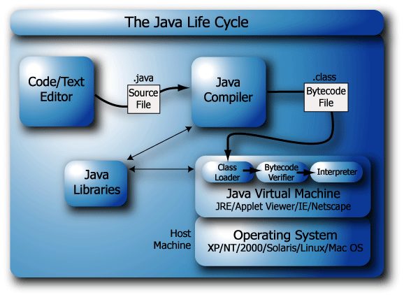

# Java Core Lesson 1: Giới thiệu tổng quan về Java Core

## Java là gì ?

> Java là một ngôn ngữ lập trình cấp cao, đa năng, hướng đối tượng và bảo mật được phát triển bởi James Gosling tại Sun Microsystems, Inc. vào năm 1991. Nó được chính thức gọi là Oak. Năm 1995, Sun Microsystem đổi tên thành Java. Năm 2009, Sun Microsystem tiếp quản bởi Oracle Corporation.

## Các tính năng

1. **Simple:** Java là một ngôn ngữ đơn giản vì cú pháp của nó đơn giản, rõ ràng và dễ hiểu. Các khái niệm phức tạp và mơ hồ của C++ hoặc bị loại bỏ hoặc được triển khai lại trong Java.
2. **Object**-Oriented: Trong Java, mọi thứ đều ở dạng đối tượng. Nó có nghĩa là nó có một số dữ liệu và hành vi. Một chương trình phải có ít nhất một lớp và đối tượng.
3. **Robust**: Java nỗ lực kiểm tra lỗi trong thời gian chạy và thời gian biên dịch. Nó sử dụng một hệ thống quản lý bộ nhớ mạnh được gọi là bộ thu gom rác. Các tính năng xử lý ngoại lệ và thu gom rác làm cho nó trở nên mạnh mẽ.
4. **Secure:** Java là một ngôn ngữ lập trình an toàn vì nó không có con trỏ và chương trình rõ ràng chạy trong máy ảo. Java chứa một người quản lý bảo mật xác định quyền truy cập của các lớp Java.
5. **Platform-Independent:** Java đảm bảo rằng mã viết một lần và chạy ở mọi nơi. Mã byte này độc lập với nền tảng và có thể chạy trên bất kỳ máy nào.
6. **Portable**: Java bytecode có thể được mang đến bất kỳ nền tảng nào. Không có các tính năng phụ thuộc thực hiện. Tất cả mọi thứ liên quan đến lưu trữ đều được xác định trước, ví dụ, kích thước của các loại dữ liệu nguyên của nó.
7. **High Performance:** Java là một ngôn ngữ thông dịch. Java cho phép hiệu suất cao với việc sử dụng trình biên dịch Just-In-Time.
8. **Distributed:** Java cũng có các phương tiện kết nối mạng. Nó được thiết kế cho môi trường phân tán của internet vì nó hỗ trợ giao thức TCP/IP. Nó có thể chạy qua internet. EJB và RMI được sử dụng để tạo ra một hệ thống phân tán.
9. **Multi-threaded:** Java cũng hỗ trợ đa luồng. Nó có nghĩa là xử lý nhiều hơn một công việc một lúc.

## Vòng đời của Java



Bao gồm **5** giai đoạn:

	1. **Code**/Text Editor.
	1. **Java Compiler**: Biên dịch chương trình thành tệp bytecode.
	1. **Class Loader**: Đọc các tiệp chứa mã bytecode và lưu vào bộ nhớ RAM.
	1. **Bytecode Verifiler**: Checking file.
	1. **Interpreter**: Biên dịch thành mã máy.

## Các thuật ngữ cơ bản

1. **Class:** Là một bản thiết kế thể hiện của một đối tượng. Nó được định nghĩa là một mô tả dữ liệu và hành vi được liên kết.
2. **Object:** Đối tượng của một Class. Là thực tể có hành vi và trạng thái.
3. **Method:** Hành vi của một đối tượng là phương thức.
4. **Instance variables:** Mỗi đối tượng có tập hợp các biến thể hiện duy nhất của riêng mình. Trạng thái của một đối tượng thường được tạo bởi các giá trị được gán cho các biến thể này.


**Ví dụ qua CODE:**

```java
// Định nghĩa một class Person
public class Person {
    // Instance variables (Biến đối tượng)
    String name;
    int age;

    // Constructor (Hàm khởi tạo)
    public Person(String name, int age) {
        this.name = name;
        this.age = age;
    }

    // Method (Phương thức) để hiển thị thông tin của Person
    public void displayInfo() {
        System.out.println("Name: " + name);
        System.out.println("Age: " + age);
    }

    // Method (Phương thức) để thay đổi thông tin tuổi của Person
    public void setAge(int newAge) {
        this.age = newAge;
    }
}

// Tạo đối tượng Person và sử dụng các phương thức và biến đối tượng
public class Main {
    public static void main(String[] args) {
        // Tạo một đối tượng Person
        Person person1 = new Person("Alice", 25);

        // Gọi phương thức để hiển thị thông tin
        person1.displayInfo(); // In ra: Name: Alice, Age: 25

        // Gọi phương thức để thay đổi tuổi
        person1.setAge(30);

        // Hiển thị thông tin sau khi thay đổi
        person1.displayInfo(); // In ra: Name: Alice, Age: 30
    }
}

```

