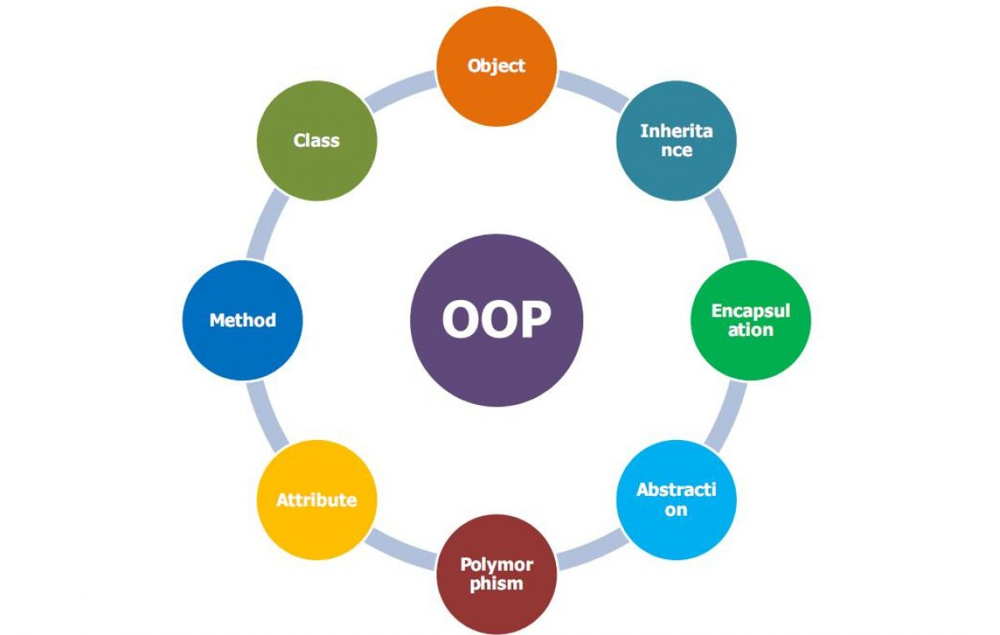

`OOP viết tắt của Object-Oriented-Programming. Là một phương pháp lập trình cho phép xây dựng các ứng dụng dựa trên đối tượng. Các đối tượng thực tế trong thế giới thực. Tập trung vào đóng gói dữ liệu và chức năng liên quan vào một đối tượng riêng lẻ. Giúp cho việc phát triển, bảo trì và mở rộng trở nên dễ dàng.`

Các khái niệm quan trọng như:
1. Kế thừa
2. Đa hình
3. Trừu tượng hoá
4. Đóng gói dữ liệu.

=> Giúp LTV xây dựng ứng dụng có tính linh hoạt và dễ bảo trì.

Đối tượng trong OOP bao gồm 2 thành phần chính:

- Thuộc tính (Attribute): là những thông tin, đặc điểm của đối tượng
- Phương thức (Method): là những hành vi mà đối tượng có thể thực hiện
## Đi sâu vào khái niệm



Đối tượng có nghĩa là thực thể trong thế giới thực... OOP cung cấp 1 số khái niệm:
- **Object**: Là 1 thực thể trong thế giới thực -> Trong lập trình OOP, đối tượng là một thể hiện của một lớp.
- **Class**: Lớp là một bản thiết kế hoặc mẫu cho việc tạo ra các đối tượng. Nó chứa các thuộc tính và phương thức của đối tượng.
- **Inheritance**: Kế thừa là một tính năng cho phép lớp mới được tạo ra bằng cách sử dụng các thuộc tính và phương thức của một lớp hiện có. Lớp mới được gọi là lớp con và lớp ban đầu gọi là lớp cha. Tính kế thừa giúp tăng tính tái sử dụng và giảm lượng mã lặp lại.
- **Polymorphism**: Đa hình, là khả năng một đối tượng để thực hiện các hành động khác nhau theo cách khác nhau. Trong lập trình OOP, đa hình được đạt được thông qua việc sử dụng kế thừa và ghi đè phương thức.
- **Abstraction**: Trừu tượng là khả năng để loại bỏ chi tiết không cần thiết và tập trung vào tính chất quan trọng của đối tượng.
- **Encapsulation**: Bao đóng là khả năng để ẩn các chi tiết của một đối tượng khỏi thế giới bên ngoài, chỉ cho phép truy cập đến các thành phần được công khai.

Ngoài ra còn một số khái niệm khác:
- **Coupling** (Liên kết): Đề cập đến mức độ phụ thuốc giữa các lơp trong một chương trình. Một liên kết yếu là tốt hơn, vì nó làm cho mã dễ đọc, bảo trì và tái sử dụng hơn.
- **Cohesion** (Cohesion): Đề cập đến mức độ tổng hợp của các thành phần của một lớp hoặc một module. Một module có cohesion cao có các thành phần hoạt động tốt với nhau, làm cho mã dễ hiểu và dễ bảo trì và tái sử dụng hơn.
- **Association**(Liên kết): Liên kết đề cập đến mối quan hệ giữa các đối tượng trong một chương trình.
- **Aggregation**: Là một dạng liên kết mà một đối tượng chứa một hay nhiều đối tượng khác như một phần của nó.
- **Composition**: Là một dạng liên kết mạnh hơn so với aggregation, trong đó một đối tượng tồn tại như một phần của một đối tượng khác. 

## Constructor

`Trong lập trình hướng đối tượng, constructor là một phương thức đặc biệt được gọi để khởi tạo một đối tượng mới của một lớp. Constructor có tên giống như tên lớp và được sử dụng để thiết lập giá trị ban đầu của các thuộc tính của đối tượng. Khi tạo một đối tượng mới của lớp, constructor sẽ được gọi ngay lập tức để khởi tạo đối tượng và trả về đối tượng đó.`

Một số quy tắc khi định nghĩa constructor:

- Constructor phải có tên giống với tên lớp.
- Constructor không có kiểu trả về.
- Constructor có thể có hoặc không có tham số.
- Constructor có thể được gọi từ constructor khác trong cùng lớp sử dụng từ khóa "this".
- Constructor có thể gọi constructor của lớp cha sử dụng từ khóa "super".

Ví dụ:
```
public class Person {
    private String name;
    private int age;

    // constructor không tham số
    public Person() {
        name = "Unknown";
        age = 0;
    }

    // constructor có tham số
    public Person(String name, int age) {
        this.name = name;
        this.age = age;
    }

    // getter và setter
    public String getName() {
        return name;
    }

    public void setName(String name) {
        this.name = name;
    }

    public int getAge() {
        return age;
    }

    public void setAge(int age) {
        this.age = age;
    }
}

```

## Phạm vi truy cập ( Access Modifier)

Java cung cấp 4 loại phạm vi truy cập khác nhau:

- **Public**: Cho phép truy cập từ bất kỳ đâu, ngay cả từ các lớp khác trong các package khác nhau.
- **Private**: Chỉ cho phép truy cập từ trong cùng lớp đó, không cho phép truy cập từ bên ngoài.
- **Protected**: Cho phép truy cập từ trong cùng lớp đó và các lớp con, cũng như các lớp ở trong cùng package.
- **Default**: Cho phép truy cập từ trong cùng lớp đó và các lớp ở trong cùng package, nhưng không cho phép truy cập từ bên ngoài package.

