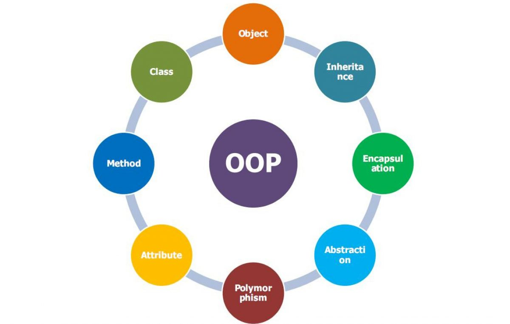

`OOP viết tắt của Object-Oriented-Programming. Là một phương pháp lập trình cho phép xây dựng các ứng dụng dựa trên đối tượng. Các đối tượng thực tế trong thế giới thực. Tập trung vào đóng gói dữ liệu và chức năng liên quan vào một đối tượng riêng lẻ. Giúp cho việc phát triển, bảo trì và mở rộng trở nên dễ dàng.`
Slide: https://drive.google.com/drive/folders/1eHNFPZ5cmb7iTMdONDvbZDQsIzu2SXUH?usp=sharing
Các khái niệm quan trọng như:
1. Kế thừa
2. Đa hình
3. Trừu tượng hoá
4. Đóng gói dữ liệu.

=> Giúp LTV xây dựng ứng dụng có tính linh hoạt và dễ bảo trì.

## Đi sâu vào khái niệm

Đối tượng có nghĩa là thực thể trong thế giới thực... OOP cung cấp 1 số khái niệm:
- Object: Là 1 thực thể trong thế giới thực -> Trong lập trình OOP, đối tượng là một thể hiện của một lớp.
- Class: Lớp là một bản thiết kế hoặc mẫu cho việc tạo ra các đối tượng. Nó chứa các thuộc tính và phương thức của đối tượng.
- Inheritance: Kế thừa là một tính năng cho phép lớp mới được tạo ra bằng cách sử dụng các thuộc tính và phương thức của một lớp hiện có. Lớp mới được gọi là lớp con và lớp ban đầu gọi là lớp cha. Tính kế thừa giúp tăng tính tái sử dụng và giảm lượng mã lặp lại.
  